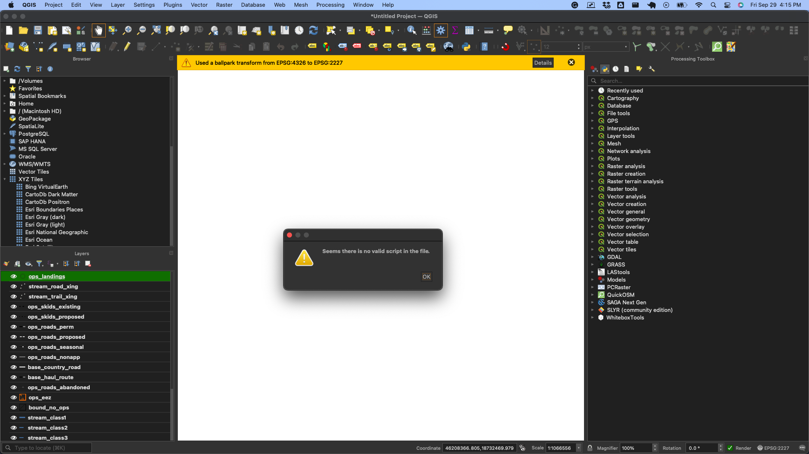

# THP GIS Project Setup

## Use Case

This geopackage and script were created for preparing timber harvest maps in QGIS. The geopackage contains all of the symbology. The script sets the layering order.

## setup 

Download the geopackage and loadgpkg.py script to your local machine.

## usage

1. in QGIS at the top of the tools screen click on the scripts icon and "open existing script"
<!-- need to add image from tutorials/images/import/1.png -->

2. select the script

3. click "run script"

4. select the geopackage. If you intend to use this geopackage as a boilerplate off which to build all your projects, make a copy of the geopackage to your project directory and select the copy.

5. you will see an error. ignore it.

### Digitize your data

remove the layers from the layers panel that you do not need. Then you can select a remaining layer to edit and begin digitizing. The THP map formatting will automatically be applied.

### add your own data

if you have a layer that you would like to add to the geopackage, you can do so by right clicking on the layer and selecting "export" and then "save features as..." and specify the geopackage. Give it a unique table/layer name. you can then open the new layer's properties and set the style to one from within the geopackage. 

## change layering order

If you would like to change the layering order, you can do so by opening the script in a text editor and changing the order of the layers in the list. The layers are listed in the order that they will appear in the layers panel. 

## To Dos 

- [ ] create a script to replace an existing table with data provided by the user and set the new data to have the same style as the replaced.

## Contributing

Bug reports and pull requests are welcome on GitHub. Stylistic recommendations are also welcome. 

